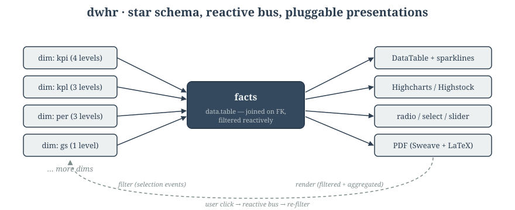

# dwhr

> Reactive Shiny dashboards over star-schema data warehouses — drillable
> hierarchies, sparkline DataTables, Highcharts, and write-back PDF reports.

[](https://lifecycle.r-lib.org/articles/stages.html)
[](LICENSE.md)

[demo.webm](https://github.com/user-attachments/assets/c7565aec-0549-4568-82c2-8ad70500f86a)

> **Note on the demo data:** the showcase apps in `inst/examples/15PdfShowcase/` is the dwhr framework
> running over a Game-of-Thrones-anonymized dimension set in place of the
> real Dutch academic-hospital data it was built for.
> See [`docs/DEMO-DATA.md`](docs/DEMO-DATA.md) for the rewrite spec.

## What you get

- **Star schema you wire up in 5 calls** — `new.star() %>% addDimView() %>% addMeasure() %>% addPresentation() %>% renderDims()`. The package handles the reactive plumbing.
- **Drillable hierarchies** — dims have N levels; selecting at level *i* re-filters every other dim and presentation in real time.
- **Pluggable presentations** — DataTables (with conditional formatting + sparklines), Highcharts/Highstock, and form controls (`radioButton`, `selectInput`, `dateRangeInput`, `rangeSliderInput`).
- **Write-back PDF reports** — Sweave/LaTeX templates fed by reactive selections, generated asynchronously via `future`. Comments persist back to a database.

## Architecture



## Quick start

```sh
git clone https://github.com/howardrcc/dwhr.git
cd dwhr
R -e 'devtools::install(".", quick = TRUE)'
R -e 'shiny::runApp("inst/examples/01SimpleTable", port = 4815)'
```

Open <http://localhost:4815>. Full setup (macOS / Nix / Docker, system deps,
LaTeX for PDF rendering): see [`docs/INSTALL.md`](docs/INSTALL.md) and
[`docs/GETTING-STARTED.md`](docs/GETTING-STARTED.md).

## Examples

Each app under `inst/examples/<n>/` is a self-contained Shiny app.
Read the `server.R` of any of them to learn the API by reading.

| Example | Demonstrates |
|---|---|
| `01SimpleTable` | Basic `dataTable` presentation — minimal hello-world |
| `02DerrivedMeasure` | Custom aggregation functions |
| `03SortColumn` | Sortable columns + per-column ordering |
| `04DataTableStyle1` | Conditional formatting (color cuts) |
| `05DataTableStyle2` | Advanced styling |
| `06SelectableLevels` | Level-selection controls |
| `07MoreDimViews` | Multiple dimensions |
| `08DataFromDb` | Database-backed facts (RODBC → DBI in W3) |
| `09ColumnChart` | Highcharts presentation |
| `10PresentationSplit` | Multiple presentations per dim |
| `11PresentationList` | Switching between presentation lists |
| `12DateRangeInput-1` | Date-range form control as a dim |
| `13RangeInput` | Numeric range slider as a dim |
| `14DateRangeInput-2` | Date-range variant |
| `15PdfShowcase` ⚔️ | The full BI loop: drill, comment, write-back, async PDF generation |
| `16D3Sankey` ⚔️ | networkD3 / Sankey integration |
| `17MunicipalShowcase` ⚔️ | sf / leaflet / ggplot geospatial maps |
| `20Clone` | `clone.star()` for printing parallel state |

⚔️ = uses the GoT-anonymized demo data set.

Run any example:

```r
shiny::runApp("inst/examples/01SimpleTable")
```

## Documentation

| Doc | What's in it |
|---|---|
| [`CLAUDE.md`](CLAUDE.md) | Architecture orientation — `star` is an environment, reactive bus, file map |
| [`docs/GETTING-STARTED.md`](docs/GETTING-STARTED.md) | macOS dev setup |
| [`docs/INSTALL.md`](docs/INSTALL.md) | Homebrew + Nix install paths; Linux/Windows deferred |
| [`docs/DOCKER.md`](docs/DOCKER.md) | Dev container spec (image, compose, .devcontainer/) — implementation pending |
| [`docs/DEPLOYMENT.md`](docs/DEPLOYMENT.md) | Production deployment contract — SHINYPROXY env var, dbCred.rds, TEST badge, auth gate |
| [`docs/DEMO-DATA.md`](docs/DEMO-DATA.md) | GoT anonymization spec for `15PdfShowcase` |
| [`docs/MODERNIZATION.md`](docs/MODERNIZATION.md) | CRAN-bound modernization plan + append-only decision log |
| [`docs/ARCHITECTURE-FUTURES.md`](docs/ARCHITECTURE-FUTURES.md) | Stack-level evaluation: dwhr vs Streamlit / Dash / Superset / etc. |
| [`docs/PERFORMANCE-BASELINE.md`](docs/PERFORMANCE-BASELINE.md) | Measured server-side R performance at 1M and 10M facts rows |

## Function reference

```r
?new.star
?addDimView
?addMeasure
?addPresentation
?renderDims
```

## License

MIT — see [LICENSE.md](LICENSE.md).

## In Memory of Pieter Timmerman

This library is dedicated to the memory of Pieter Timmerman, a mentor who taught by example rather than instruction. When I was starting out, Pieter showed me what it meant to be a principled developer—someone who remained steadfast in their commitment to open source even as the tech world grew increasingly complex and corporate. He wasn't impressed by big tech; he was guided by his values. This project is open sourced in his honor, carrying forward the spirit of generosity and integrity he embodied. Thank you, Pieter, for being there.
